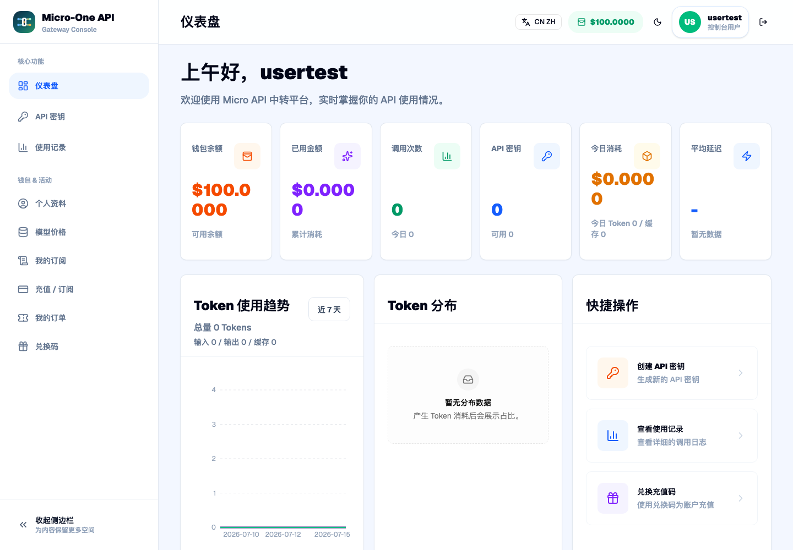
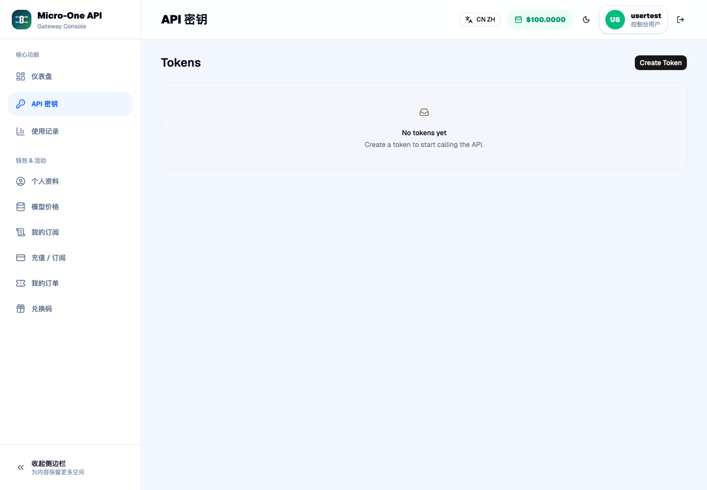
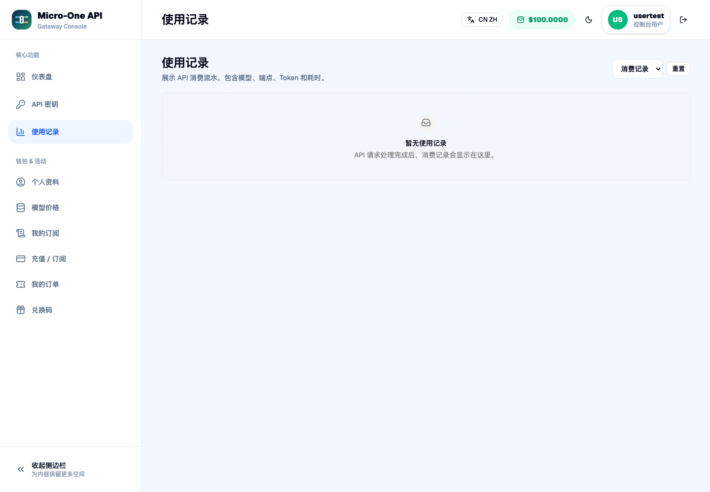
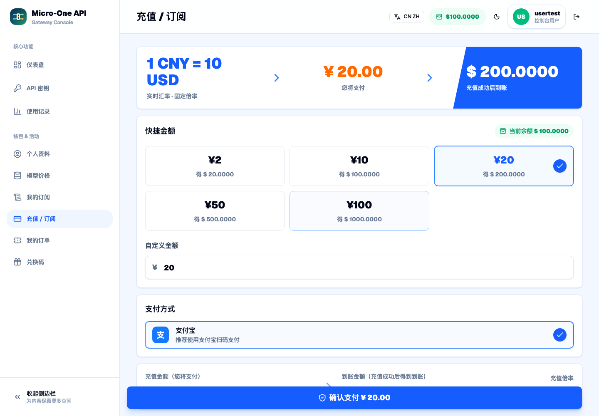
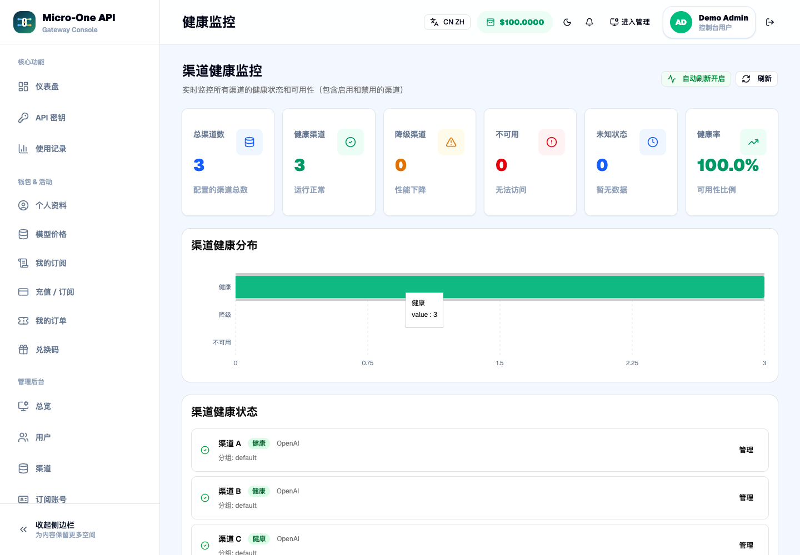
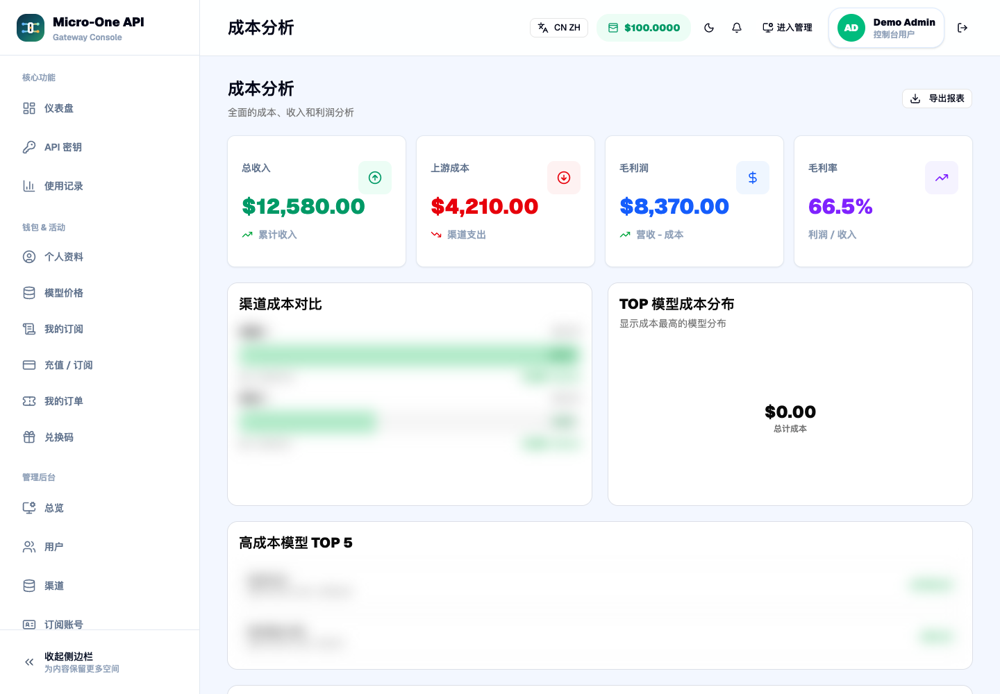
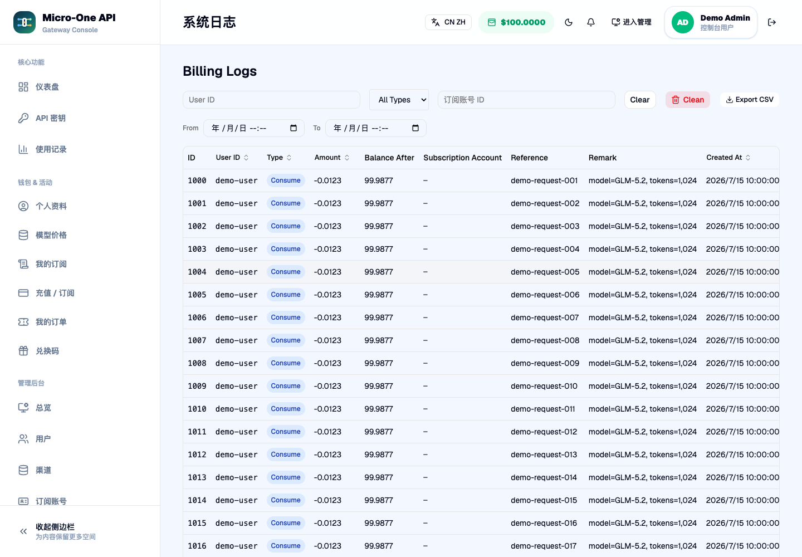
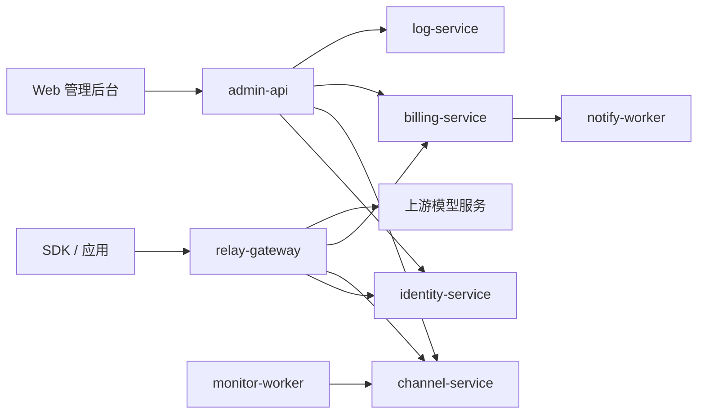

# micro-one-api


`micro-one-api` 是一个基于 Go Kratos 的多服务 AI API 网关与管理系统。项目参考了 [one-api](https://github.com/songquanpeng/one-api) 的多渠道 OpenAI API 分发思路，也参考了 [sub2api](https://github.com/Wei-Shaw/sub2api) 对订阅额度窗口、账号池、限流和用量管理的设计方向，并将核心能力拆分为更清晰的微服务边界。

本项目面向需要统一管理多个上游模型供应商、钱包余额、访问令牌、账务和运营后台的场景。它不是上游服务的替代品，也不提供任何第三方模型账号、订阅或 API Key。

> 📣 **最新发布**：[v0.7.2 发布公告](./docs/releases/release-v0.7.2.md)（OAuth 回调修复、Compose 显式迁移、Kubernetes 清单与部署文档收口） · [GitHub Release](https://github.com/mengbin92/micro-one-api/releases/tag/v0.7.2)

## 功能概览

- OpenAI 兼容 API 网关：支持 `/v1/chat/completions`、`/v1/models`、`/v1/responses` 以及 embeddings、audio、image、moderations 等 raw relay 路由。
- 多渠道模型分发：支持渠道优先级、同优先级负载均衡、禁用渠道过滤、模型白名单和模型映射。
- 多供应商适配：支持 OpenAI-compatible 渠道，并包含 Anthropic、Gemini、Azure、VoyageAI 等 provider 适配器；DeepSeek、Moonshot、Groq、Tongyi、OpenRouter、SiliconFlow、Ollama、Doubao 等按 OpenAI-compatible 方式转发。
- 用户与令牌管理：支持用户鉴权、令牌状态、过期时间、余额检查、模型权限和用户角色控制。
- 钱包与账务：提供金额预扣、释放、结算、ledger、兑换码、支付订单和用量记录等能力。
- 订阅套餐与用量查询：支持订阅套餐购买、续费、退款/冲正、购买时套餐快照，以及 API Key 鉴权的 `/v1/subscription/usage` 查询（额度、已用量、剩余额度和下次刷新时间）。
- 订阅账号治理：支持订阅账号本地额度、fixed daily/weekly 重置、账号恢复、额度告警、单用户单 active 订阅约束和多副本幂等治理记录。
- 成本与利润分析：`billing_ledgers` 记录上游成本，账本聚合支持收入/成本/毛利维度，可按模型、渠道、用户、Token、时间下钻。
- 多维用量聚合：用量统计改为 SQL `GROUP BY` 聚合（按用户/渠道/模型/Token/分组/小时|日），告别 admin 抽样估算。
- 对账与告警：`RunReconciliation` 覆盖账户余额、渠道用量、ledger/log 双写一致性；差异通过 `notify-worker` 投递通知（可配置收件人）。
- 成本健康 dashboard：管理后台展示成本/毛利/渠道余额健康指标；用量统计与账本支持缓存 token（`cache_read_tokens`）与命中率展示。
- 管理后台：提供 React/Vite 前端和 `admin-api` BFF，用于管理用户、令牌、渠道、订阅套餐、订单、兑换码、用量和系统配置。
- 监控与日志：提供健康检查、Prometheus metrics、业务日志聚合、监控 worker 和通知 worker；对账任务与渠道健康探测暴露运行次数、耗时和失败原因指标。
- 部署形态：支持本地开发、Docker Compose 和 Kubernetes 部署。

## 界面预览

以下截图来自测试账号或经过脱敏的管理页面。API Key 未展示；渠道名称、用户标识和账务流水已替换为演示内容，运营金额已替换或模糊处理。

| 用户仪表盘 | Token 管理 |
|:---:|:---:|
|  |  |
| 用量记录 | 充值与订阅套餐 |
|  |  |
| 渠道健康监控 | 成本分析 |
|  |  |
| 账务日志 | |
|  | |

## 适合谁 / 不适合谁

| 适合 | 不适合 |
|------|--------|
| 需要自托管统一入口，管理多个 OpenAI-compatible 或专用 provider 渠道的团队 | 只需要单机、单用户、单上游转发，希望一个二进制零配置启动的场景 |
| 需要用户、Token、钱包、订阅、账务、用量、成本和运营后台的内部平台或 SaaS 团队 | 希望项目直接提供上游模型账号、订阅、API Key 或代替第三方模型服务的用户 |
| 需要 Docker Compose / Kubernetes 部署，并希望按服务边界扩展和审计的工程团队 | 不准备维护 MySQL、Redis、多服务部署和监控体系的轻量个人用途 |
| 已获得上游服务合法授权，需要在组织内部做统一鉴权、调度和成本治理的使用者 | 试图绕过上游访问限制、账号规则、计费规则或服务条款的用途 |

## 架构



请求路径以 `relay-gateway` 为入口，鉴权、渠道选择和账务结算分别由对应服务负责；管理前端通过 `admin-api` 聚合管理接口，监控与通知 worker 处理异步运营任务。

当前仓库按 Kratos 服务边界组织：

| 服务 | 职责 |
|------|------|
| `relay-gateway` | OpenAI 兼容 HTTP 网关，负责鉴权、选路、金额预扣、上游转发和响应透传 |
| `admin-api` | 管理端 BFF，并托管或代理管理前端静态资源 |
| `identity-service` | 用户、角色、登录鉴权、Token 校验与权限判断 |
| `channel-service` | 渠道、模型、分组、优先级和可用渠道选择 |
| `billing-service` | 钱包余额、账务流水、兑换码、支付订单和扣费结算 |
| `config-service` | 动态配置管理 |
| `log-service` | 业务日志写入、查询和删除代理 |
| `monitor-worker` | 监控任务与告警触发 |
| `notify-worker` | 通知发送 |

目录结构：

| 目录 | 说明 |
|------|------|
| `api/` | gRPC、HTTP 和 OpenAPI 相关 proto 定义及生成代码 |
| `app/` | 子服务大仓（admin/billing/channel/config/identity/log/monitor/notify），各含 `cmd/`、`internal/`、`configs/`、`Dockerfile`、`Makefile` |
| `cmd/` | 根服务入口（`relay-gateway/`、`migrate/`、`admin-reset/`） |
| `configs/` | relay-gateway 配置文件 |
| `internal/` | relay-gateway 业务实现和 `conf` 配置 proto |
| `domain/` | 共享域库（`subscription` 订阅域、`upstream` 上游 provider），跨服务嵌入 |
| `platform/` | 基础设施层（cache/database/grpc/http/logging/metrics/middleware/registry/security/tls/tracing/websocket） |
| `pkg/` | 纯工具包（errors/safecast/safefile/timeout 等） |
| `migrations/` | MySQL schema 迁移 |
| `web/` | 管理后台前端 |
| `deployments/` | Docker、Docker Compose 和 Kubernetes 部署文件 |
| `scripts/` | 构建脚本、部署脚本、架构检查脚本 |
| `docs/` | 部署运维文档 |
| `test/` | 集成测试和端到端测试 |

## 快速开始

### Docker Compose

适合开发、测试和功能验收。

```bash
cd deployments/docker-compose
cp .env.example .env
# 编辑 .env，至少替换数据库、Redis 和服务密钥
docker compose up -d
```

默认需要在 `deployments/docker-compose/.env` 或环境变量中提供：

- `MYSQL_ROOT_PASSWORD`
- `DATABASE_DSN`
- `REDIS_PASSWORD`
- `JWT_SECRET_KEY`
- `SERVICE_TOKEN`
- `ADMIN_TOKEN`

服务启动后可访问：

- 管理后台：`http://localhost:3000`
- Relay API：`http://localhost:8080`
- 健康检查：`http://localhost:8080/healthz`

首次启动时，如果 `users` 表为空，`identity-service` 会创建初始 root 管理员。可通过 `INITIAL_ADMIN_USERNAME`、`INITIAL_ADMIN_EMAIL`、`INITIAL_ADMIN_PASSWORD` 指定；未设置密码时会生成随机密码。生产环境应设置 `INITIAL_ADMIN_PASSWORD_FILE`，服务会把随机密码写入该 0600 私有文件，不会在日志中打印明文。

### 从空环境到首个渠道和 Token

1. 按上面的 Docker Compose 步骤启动服务，确认 `http://localhost:8080/healthz` 返回成功。
2. 打开 `http://localhost:3000`，使用首次启动时配置或生成的管理员账号登录。
3. 进入 **管理后台 → 渠道 → Create Channel**，填写 `Name`、`Provider`、`Base URL`、`API Key`、`Models` 和 `Group`；`Priority`、`Weight` 可先保留默认值。
4. 保存后在渠道列表执行 **Test**，并在 **健康监控** 中确认渠道状态为健康。测试失败时先核对 Base URL 是否包含正确的 API 前缀，以及模型名称是否被上游支持。
5. 进入 **API 密钥 → Create Token**，输入用途名称（例如 `quickstart`）。新 Token 只会完整显示一次，应立即复制并安全保存。
6. 使用新 Token 验证 Relay：

```bash
export API_TOKEN='<刚创建的 Token>'
curl -H "Authorization: Bearer ${API_TOKEN}" \
  http://localhost:8080/v1/models
```

返回模型列表后，即完成从空环境部署到首个渠道和 Token 的最短链路。生产环境不要把上游 API Key、用户 Token 或管理员密码写入文档、命令历史和版本库。

### 本地开发

生成 proto 和构建：

```bash
make proto
make build
```

运行核心三服务的内存/本地链路：

```bash
make run-all
```

手动运行单个服务：

```bash
make run-identity
make run-channel
make run-relay
```

构建管理前端：

```bash
make web-dist
```

完整部署说明见 [docs/deployment.md](./docs/deployment.md)。

### 升级到 v0.7.2

v0.7.2 是 v0.7.1 之后的 PATCH 版本，无 API 或数据库 schema 破坏性变更。Compose 改为由一次性 `migrate` 服务显式执行迁移，旧数据卷升级前应先备份并按需登记 brownfield baseline。详见 [docs/releases/release-v0.7.2.md](./docs/releases/release-v0.7.2.md)。

### 升级到 v0.7.1

v0.7.1 是 v0.7.0 之后的 PATCH 版本,**不涉及数据库迁移和 API 破坏性变更**。升级步骤为重建镜像并滚动重启,无需执行 SQL 迁移。详见 [docs/releases/release-v0.7.1.md](./docs/releases/release-v0.7.1.md)。

> docker-compose 部署请注意:log-service 和 billing-service 现在强制要求 `SERVICE_TOKEN` 环境变量,缺失会导致 compose 启动失败。

### 升级到 v0.7.0

v0.7.0 是 Kratos 大仓结构迁移版本，**不涉及数据库迁移和 API 破坏性变更**。升级步骤为重建镜像并滚动重启，详见 [docs/releases/release-v0.7.0.md](./docs/releases/release-v0.7.0.md)。

> v0.6.0 及更早版本的数据库迁移说明见 [docs/releases/release-v0.6.0.md](./docs/releases/release-v0.6.0.md)。

## API 示例

### 健康检查

```bash
curl http://localhost:8080/healthz
```

### 模型列表

```bash
curl -H "Authorization: Bearer ${API_TOKEN}" \
  http://localhost:8080/v1/models
```

### 订阅用量查询

```bash
curl -H "Authorization: Bearer ${API_TOKEN}" \
  http://localhost:8080/v1/subscription/usage
```

该接口返回当前用户订阅状态、日/周/月额度、已用量、剩余额度和下次刷新时间。详细字段见 [docs/design/subscription-usage-api.md](./docs/design/subscription-usage-api.md)。

### Chat Completions

```bash
curl -X POST http://localhost:8080/v1/chat/completions \
  -H "Content-Type: application/json" \
  -H "Authorization: Bearer ${API_TOKEN}" \
  -d '{
    "model": "gpt-4o-mini",
    "messages": [
      {"role": "user", "content": "Hello"}
    ]
  }'
```

流式响应：

```bash
curl -X POST http://localhost:8080/v1/chat/completions \
  -H "Content-Type: application/json" \
  -H "Authorization: Bearer ${API_TOKEN}" \
  -d '{
    "model": "gpt-4o-mini",
    "messages": [
      {"role": "user", "content": "Hello streaming"}
    ],
    "stream": true
  }'
```

## 配置要点

常用环境变量：

| 变量 | 说明 |
|------|------|
| `CONF_PATH` | 服务配置文件路径，例如 `configs/config.yaml` |
| `MODELS_PATH` | relay-gateway 模型映射配置路径；本地可设为 `configs/models.yaml` |
| `DATABASE_DSN` | MySQL 连接字符串 |
| `REDIS_ADDR` / `REDIS_PASSWORD` | Redis 地址与密码 |
| `JWT_SECRET_KEY` | 用户登录和鉴权相关密钥 |
| `SERVICE_TOKEN` | 服务间 HTTP 调用令牌 |
| `ADMIN_TOKEN` | 管理 API 兼容鉴权令牌 |
| `LOG_MEMORY_MODE` | 允许 log-service 无数据库时使用内存日志，仅用于开发/测试 |
| `LOG_RETENTION_DAYS` | log-service 业务日志保留天数 |
| `IDENTITY_GRPC_ENDPOINT` | identity-service gRPC 地址 |
| `CHANNEL_GRPC_ENDPOINT` | channel-service gRPC 地址 |
| `BILLING_GRPC_ENDPOINT` | billing-service gRPC 地址 |
| `RELAY_HTTP_ADDR` | relay-gateway HTTP 监听地址 |
| `RELAY_PROVIDER_TIMEOUT` | 上游 provider 请求超时 |
| `CHANNEL_HEALTH_FAILURE_THRESHOLD` / `CHANNEL_HEALTH_COOLDOWN` | 渠道自动熔断阈值和冷却时间；默认连续 3 次上游失败后跳过 5 分钟 |
| `CHANNEL_HEALTH_CHECK_ENABLED` / `CHANNEL_HEALTH_CHECK_INTERVAL` / `CHANNEL_HEALTH_CHECK_TIMEOUT` | monitor-worker 定时渠道 `/models` 健康探测开关、间隔和单次超时 |
| `CHANNEL_HEALTH_ALERT_ENABLED` | 渠道健康状态首次进入 `unavailable` 时是否投递通知 |
| `CHANNEL_HEALTH_ALERT_NOTIFY_TYPE` | 渠道不可用告警通知类型，支持 `event` / `webhook` / `email` / `wecom` / `dingtalk` / `feishu` / `slack` |
| `CHANNEL_HEALTH_ALERT_RECIPIENTS` | 渠道不可用告警目标，JSON 数组；webhook/event 可填 URL 或留空走 `NOTIFY_WEBHOOK_URL`，email 填邮箱，IM 通道留空走对应配置 |
| `SUBSCRIPTION_USER_RPM_LIMIT` | relay 订阅用户 RPM 限制；默认 `0` 表示关闭，避免无配置时误限流 |
| `RATE_LIMIT_REQUESTS_PER_SECOND` / `RATE_LIMIT_BURST` | 网关限流参数 |
| `CORS_ALLOWED_ORIGINS` | CORS 允许来源 |
| `ADMIN_WEB_ROOT` | admin-api 使用的外部前端构建目录 |
| `NOTIFY_GRPC_ENDPOINT` | channel 健康告警和 billing 对账告警投递目标（notify-worker gRPC）；留空则不投递通知 |
| `RECON_ALERT_ENABLED` | 是否启用对账差异告警（`true`/`false`） |
| `RECON_ALERT_NOTIFY_TYPE` | 对账告警通知类型，支持 `event` / `webhook` / `email` / `wecom` / `dingtalk` / `feishu` / `slack` |
| `RECON_ALERT_RECIPIENTS` | 对账告警目标，JSON 数组；webhook/event 可填 URL 或留空走 `NOTIFY_WEBHOOK_URL`，email 填邮箱，IM 通道留空走对应配置 |
| `RECON_ALERT_INTERVAL` | 对账任务执行间隔，例如 `1h`、`30m` |
| `NOTIFY_WEBHOOK_URL` | notify-worker 默认 webhook 投递地址 |
| `NOTIFY_SMTP_HOST` / `NOTIFY_SMTP_PORT` / `NOTIFY_SMTP_USER` / `NOTIFY_SMTP_PASS` / `NOTIFY_SMTP_FROM` | notify-worker 邮件投递配置 |

Prometheus 指标通过各服务 `/metrics` 暴露。订阅系统新增 `micro_one_api_subscription_quota_checks_total`、`micro_one_api_subscription_usage_records_total`，relay 订阅账号路径新增 `micro_one_api_relay_subscription_adaptor_requests_total`、`micro_one_api_relay_subscription_failover_total`、`micro_one_api_relay_runtime_blocks_total`、`micro_one_api_relay_upstream_passthrough_total`、`micro_one_api_relay_codex_quota_snapshots_total`、`micro_one_api_relay_codex_quota_used_percent`。v0.6.0 起，订阅账号治理还暴露额度重置、账号恢复和额度告警相关指标，详见 [docs/runbooks/subscription-account-ops-runbook.md](./docs/runbooks/subscription-account-ops-runbook.md)。

更多配置见 [.env.example](./.env.example) 和 [docs/deployment.md](./docs/deployment.md)。

## 测试

```bash
# 单元测试和不依赖外部服务的集成测试
make test

# 指定模块测试
make dev-test-identity
make dev-test-channel
make dev-test-provider

# Docker Compose 端到端测试
make test-e2e
```

## 安全提醒

- 生产环境必须替换 `JWT_SECRET_KEY`、`SERVICE_TOKEN`、`ADMIN_TOKEN`、数据库密码和 Redis 密码。
- 不要将真实上游 API Key、订阅凭证、支付私钥或管理员密码提交到仓库。
- 建议生产环境开启 HTTPS，并按需启用 mTLS、IP 过滤、限流和密钥轮换。
- 管理后台和 Relay API 应分别配置访问控制，不建议直接裸露在公网。
- 使用第三方模型、API、订阅或账号池时，应确认你拥有合法授权，并遵守对应服务条款。

## 免责声明

本项目仅作为 AI API 网关、渠道调度、钱包账务管理和微服务架构实践工具提供。使用者应自行确保部署、配置、账号来源、API Key 来源、调用内容、支付能力和数据处理行为符合适用法律法规及第三方服务条款。

项目维护者不提供任何第三方模型服务、订阅账号、API Key 或绕过访问限制的能力，也不对使用者因滥用、违规接入、账号封禁、额度损失、数据泄露、业务中断或其他后果承担责任。

完整免责声明见 [DISCLAIMER.md](./DISCLAIMER.md)。

## 致谢

- [one-api](https://github.com/songquanpeng/one-api)：提供了多渠道 OpenAI API 管理与分发系统的设计参考。
- [sub2api](https://github.com/Wei-Shaw/sub2api)：提供了订阅转 API、账号池、订阅额度窗口和限流管理等场景参考。
- [go-kratos/kratos](https://github.com/go-kratos/kratos)：提供了微服务框架与工程实践基础。

## 许可证

本项目使用 [MIT License](./LICENSE)。
