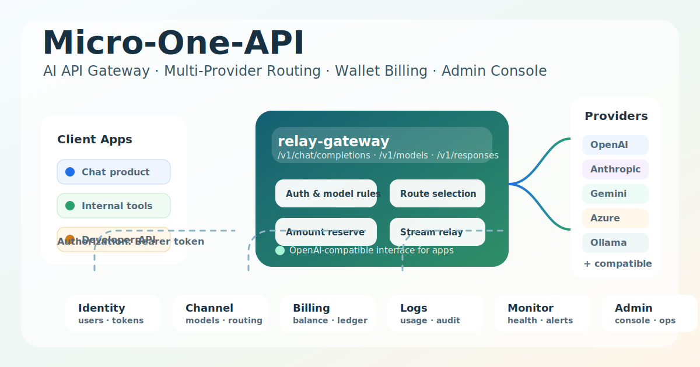

# Micro-One-API：一个面向多模型、多渠道和钱包账务管理的 AI API 网关



方形社区配图：`docs/assets/micro-one-api-community-square.png`

## 摘要

`micro-one-api` 是一个基于 Go Kratos 的多服务 AI API 网关与管理系统。它参考了 one-api 的多渠道 OpenAI API 分发思路，也借鉴了 sub2api 在订阅额度窗口、账号池、限流和用量管理上的场景经验，将用户鉴权、渠道管理、钱包账务、日志监控和管理后台拆分成清晰的微服务。

如果你正在维护多个上游模型渠道，希望统一 API 入口、统一用户 Token、统一钱包余额和用量记录，并且希望系统后续具备更强的可维护性与扩展性，这个项目可以作为一个参考实现。

## 为什么做这个项目

AI 应用落地以后，很多团队会遇到几个相似的问题：

- 上游模型越来越多，OpenAI-compatible、Anthropic、Gemini、Azure、OpenRouter、DeepSeek、Ollama 等渠道需要统一接入。
- 不同业务、用户或团队需要不同的 Token、钱包余额、模型权限和访问策略。
- 单体网关在功能越来越多以后，渠道、账务、用户、后台、日志和监控逻辑容易相互耦合。
- API 网关不仅要能转发请求，还要能做鉴权、选路、限流、用量记录、金额预扣和异常处理。
- 管理员需要一个后台来维护渠道、用户、令牌、订单、兑换码和运行状态。

`micro-one-api` 的目标不是简单再造一个 API 转发器，而是把这些能力拆成更清晰的服务边界，让网关、用户、渠道、账务和运营后台可以独立演进。

## 项目定位

`micro-one-api` 可以理解为一个面向 AI API 分发场景的微服务化基础设施：

- 对开发者：提供 OpenAI 兼容接口，降低业务应用切换模型和渠道的成本。
- 对管理员：提供渠道、用户、Token、钱包余额、订单、兑换码和用量的管理入口。
- 对运维人员：提供 Docker Compose、Kubernetes、健康检查、Prometheus metrics 和日志服务。
- 对二次开发者：提供 Go Kratos、gRPC、HTTP、proto、migration 和前后端分离的工程结构。

项目不提供任何第三方模型账号、订阅、API Key 或代理资源。使用者需要自行准备合法的上游服务凭证，并遵守对应服务条款。

## 核心能力

### 1. OpenAI 兼容 API 网关

`relay-gateway` 提供统一的 HTTP 入口，支持常见 OpenAI 风格接口，例如：

- `/v1/chat/completions`
- `/v1/models`
- `/v1/responses`
- embeddings、audio、image、moderations 等 raw relay 路由

业务应用只需要面向统一的网关地址调用，后端可以根据模型、分组、渠道状态和优先级选择合适的上游。

### 2. 多渠道与多供应商适配

项目内置 OpenAI-compatible 转发能力，并包含 Anthropic、Gemini、Azure、VoyageAI 等 provider 适配器。对于 DeepSeek、Moonshot、Groq、Tongyi、OpenRouter、SiliconFlow、Ollama、Doubao 等兼容 OpenAI 协议的渠道，也可以按统一方式接入。

渠道层支持：

- 渠道优先级
- 同优先级随机负载均衡
- 禁用渠道过滤
- 模型白名单
- 模型映射
- 上游超时控制

这些能力适合用来做多模型聚合、成本分层、备用渠道和内部团队分组。

### 3. 用户、Token 与权限管理

`identity-service` 负责用户认证和 Token 校验，支持用户状态、Token 状态、过期时间、余额检查、模型权限和角色控制。

这让系统不仅能作为个人网关使用，也能支持团队内部按用户、按 Token、按模型进行访问控制。

### 4. 钱包与账务

`billing-service` 负责钱包余额、账务流水、兑换码、支付订单和扣费结算等能力。网关在转发请求前可以进行金额预扣，并根据请求结果释放或结算金额。

这类设计适合以下场景：

- 团队内部余额分配
- API Token 消费统计
- 按用户或业务线核算成本
- 兑换码充值
- 支付订单和用量记录对账

### 5. 管理后台

项目包含 React/Vite 管理前端和 `admin-api` BFF。管理员可以通过后台维护用户、令牌、渠道、订单、兑换码、用量和系统配置。

相比只提供配置文件的网关，管理后台更适合持续运营和多人协作。

### 6. 日志、监控与部署

项目提供：

- `/healthz` 健康检查
- Prometheus `/metrics`
- 业务日志服务
- monitor worker
- notify worker
- Docker Compose 部署文件
- Kubernetes 部署文件
- MySQL migration
- Redis 集成

这使项目不仅能跑通本地开发，也能逐步迁移到更接近生产的部署方式。

## 微服务拆分

当前主要服务包括：

| 服务 | 说明 |
|------|------|
| `relay-gateway` | OpenAI 兼容 API 网关，负责鉴权、选路、金额预扣和上游转发 |
| `admin-api` | 管理后台 BFF，并托管或代理管理前端 |
| `identity-service` | 用户、角色、登录鉴权和 Token 校验 |
| `channel-service` | 渠道、模型、分组、优先级和可用渠道选择 |
| `billing-service` | 钱包余额、账务流水、兑换码、支付订单和扣费结算 |
| `config-service` | 动态配置管理 |
| `log-service` | 业务日志写入、查询和删除代理 |
| `monitor-worker` | 监控任务与告警触发 |
| `notify-worker` | 通知发送 |

这种拆分的好处是边界比较明确：网关只关心请求链路，用户服务处理身份，渠道服务处理路由，账务服务处理钱包余额，后台服务面向运营入口。后续如果要替换某个模块，也不会影响整个系统。

## 快速体验

项目支持 Docker Compose 启动，适合本地开发和功能验证：

```bash
cd deployments/docker-compose
docker compose up -d
```

启动后可以访问：

- 管理后台：`http://localhost:3000`
- Relay API：`http://localhost:8080`
- 健康检查：`http://localhost:8080/healthz`

调用示例：

```bash
curl -X POST http://localhost:8080/v1/chat/completions \
  -H "Content-Type: application/json" \
  -H "Authorization: Bearer YOUR_TOKEN" \
  -d '{
    "model": "gpt-4o-mini",
    "messages": [
      {"role": "user", "content": "Hello"}
    ]
  }'
```

本地开发也可以使用 Makefile：

```bash
make proto
make build
make test
```

## 适合哪些人

这个项目比较适合：

- 想统一管理多个 AI 模型供应商的开发者或团队。
- 想研究 AI API 网关、钱包账务系统和渠道调度的工程实现者。
- 想把 one-api 类系统拆成微服务架构的人。
- 需要内部 Token、钱包余额、用量统计和管理后台的团队。
- 正在搭建 AI 中台、模型网关或内部开发者平台的团队。

如果你只需要一个极简个人代理，完整微服务架构可能会显得偏重；如果你关注长期运营、多人管理、账务和扩展性，它会更有参考价值。

## 项目边界和合规提醒

`micro-one-api` 只提供软件实现，不提供任何第三方模型服务、账号、订阅、API Key 或绕过访问限制的能力。

部署者需要自行确保：

- 上游 API Key、账号或订阅来源合法。
- 调用内容符合当地法律法规和上游服务条款。
- 不把项目用于违规转售、滥用、攻击、垃圾信息或绕过平台限制。
- 正确保护用户数据、请求内容、响应内容、日志、账务数据和支付凭证。
- 生产环境替换默认密钥，配置 HTTPS、限流、访问控制和日志审计。

项目的完整免责声明可以查看仓库中的 `DISCLAIMER.md`。

## 后续方向

这个项目还可以继续扩展：

- 增加更多原生 provider 适配器。
- 增加 Codex 场景下的 Anthropic `/v1/messages` 代理适配，补齐 `/v1/responses` 转换、流式响应、工具调用和用量统计映射。
- 完善渠道健康检查和自动熔断。
- 强化用量统计、成本分析和对账能力。
- 增加更细粒度的用户、团队、分组和模型权限。
- 完善前端运营体验和可观测性面板。
- 加强生产部署文档、安全基线和高可用方案。

## 结语

AI 应用进入真实业务以后，问题往往不只是“怎么调用模型”，而是“怎么稳定、可控、可审计地管理模型调用”。`micro-one-api` 尝试把 API 网关、渠道路由、用户鉴权、钱包账务和管理后台放到一套清晰的微服务架构里，让团队可以在统一入口之上继续扩展自己的 AI 基础设施。

如果你对多模型网关、AI API 管理平台或 Go Kratos 微服务实践感兴趣，欢迎关注、试用和参与改进。
